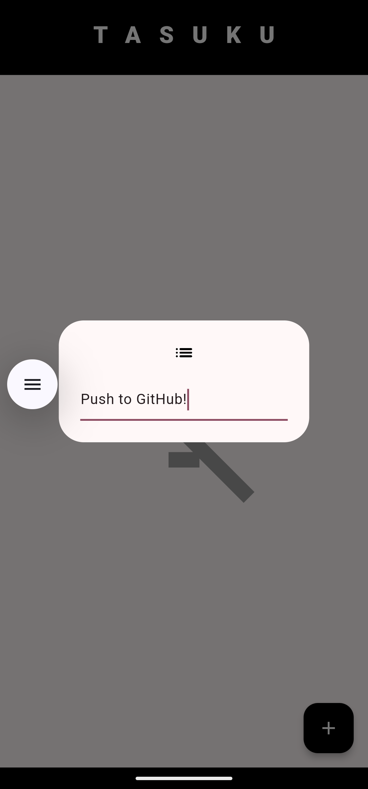

# Tasuku

Tasuku - Flutter App for Managing Tasks

## Overview

Tasuku is a simple and intuitive Flutter application designed to help you manage your daily tasks efficiently. With Tasuku, you can easily add, manage, and complete your tasks.

## Features

- Add new tasks
- Mark tasks as completed
- View all tasks in a list

## Screenshots

<div style="display: flex; flex-wrap: wrap; justify-content: space-around;">
  <div style="flex: 1; margin: 10px;">
    <h4>Home Screen</h4>
    
  </div>
  <div style="flex: 1; margin: 10px;">
    <h4>Add Note</h4>
    
  </div>
  <div style="flex: 1; margin: 10px;">
    <h4>Checked Task</h4>
    
  </div>
</div>
## Getting Started

To get started with Tasuku, follow these steps:

1. Clone the repository:
   ```sh
   git clone https://github.com/thejohncaleb/tasuku.git